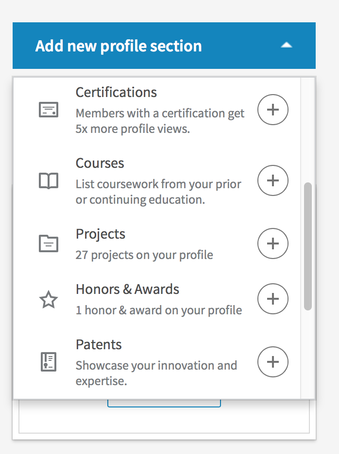
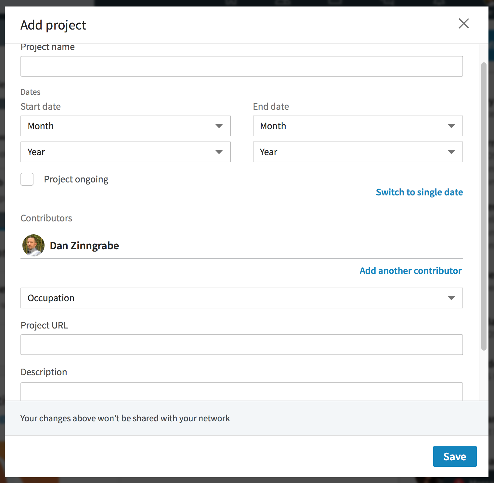
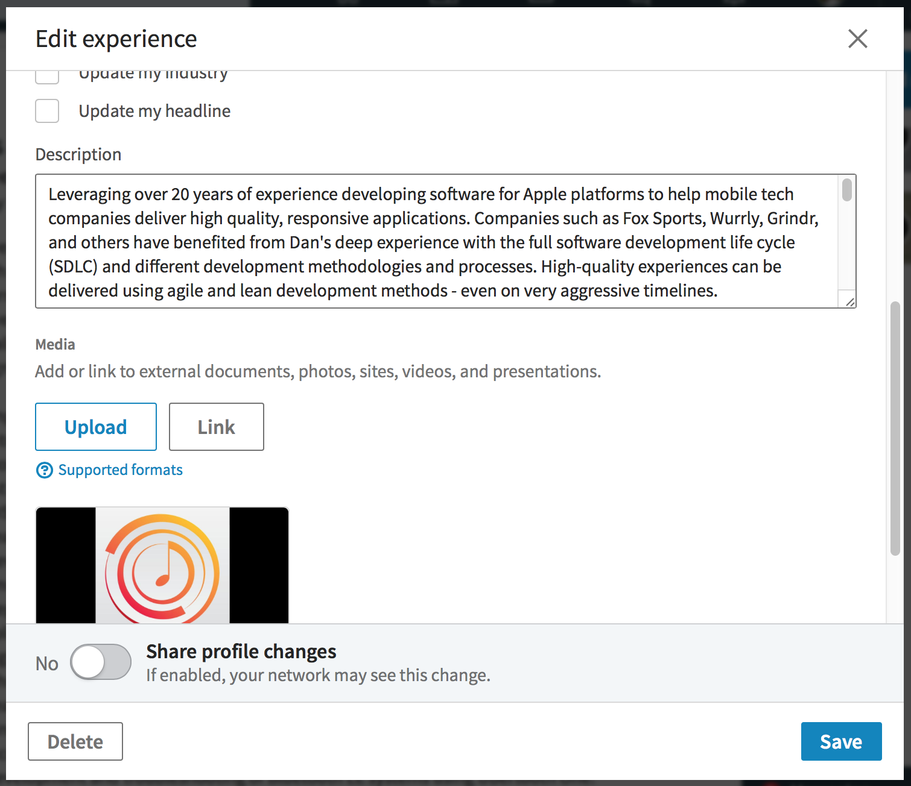

# Add Apps and Projects to Your Profile

### Adding Projects

LinkedIn profiles can list projects you have worked on. This can be great for showing the applications and open source projects you have contributed to. 

To add a project to your profile go to “Add new profile section…” in the upper right of your profile page. 

Scroll down to “Accomplishments” and click on “Projects”. This will open a dialog box for adding a new project.

For an open source project enter a link to the project home page or repository. Even better, link to your specific contributions. Describe the work you did on this project in 3 sentences.

For an application that is available on the iTunes app store use a link from [iTunes Link Maker](iTunesLinkMaker.md). 

Write a short description of what you did on this app.

### Adding apps to your work experience

If your work on this app was part of a job listed in your work experience on LinkedIn, add it there as well. Scroll to that job in the work experience section of your profile. Edit the experience information by clicking on the edit (pencil) icon. In the dialog box that is presented there, scroll down to “Media” and click “Link”. 

Paste the link you generated from iTunes Link Maker there as well.

### Adding apps to your Profile Intro

Once you have done that, think about which of these projects you are most proud of. What was your best work? Scroll your profile back up to the top and click the edit (pencil) icon to the right of your photo. This will present a dialog to edit your intro. Just like editing your work experience, you can add media here. These will be some of the first things anyone viewing your profile will see - pick the three projects and add links to them.

## What If I have Nothing To Add?

That is an excellent indication you should be contributing to an open source project!

Find a project. Start with something you actually use.

Fork/branch it.

Add unit tests or fix a bug.

Submit your changes back to the maintainer.
