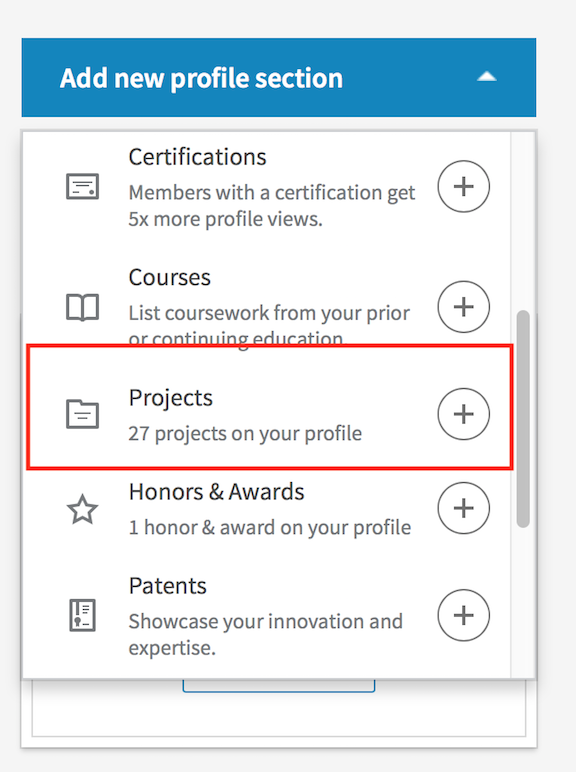
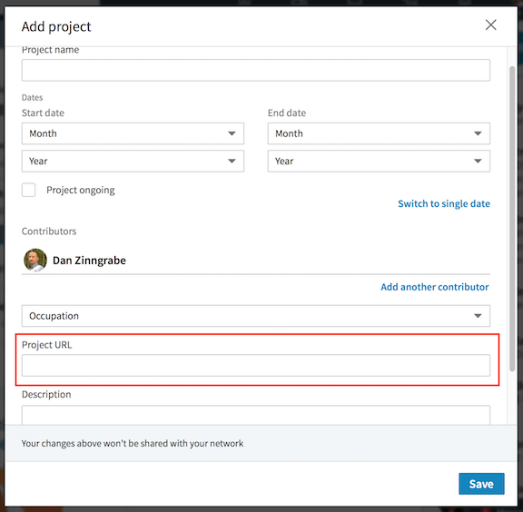
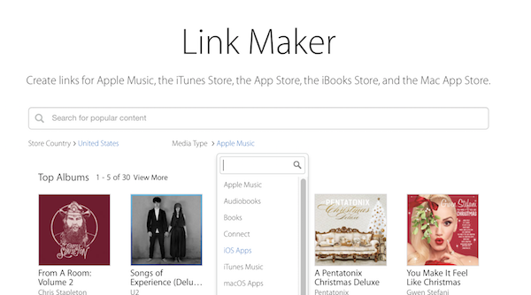
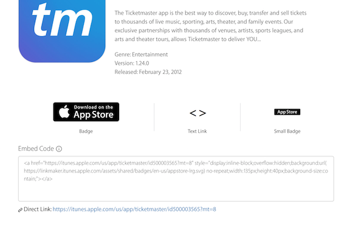
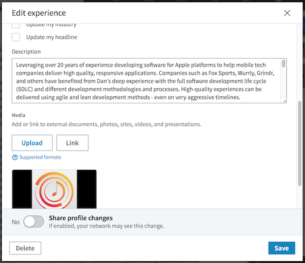

## Add Apps and Projects to Your Profile {#add-apps}

### Adding Projects {#adding-projects}

LinkedIn profiles can list projects you have worked on. This can be great for showing the applications and open source projects you have contributed to. 

To add a project to your profile go to “Add new profile section…” in the upper right of your profile page. 

Scroll down to “Accomplishments” and click on “Projects”. This will open a dialog box for adding a new project.

For an open source project enter a link to the project home page or repository. Even better, link to your specific contributions. Describe the work you did on this project in 3 sentences.

For an application that is available on the iTunes app store use a link from iTunes Link Maker. 

#### iTunes Link Maker

Look up the app using 
[iTunes Link Maker](https://linkmaker.itunes.apple.com/en-us) 

 
In the "Media Type" dropdown, select "iOS Apps" (or "macOS Apps" for the Mac App Store).
 
Search for the app by name or bundle ID. You should see a result like this:
 
 
 
This will give you the name, app store description, and a direct link to the download page. The direct link at the bottom of the page is what you will want for your LinkedIn profile. 

Write a short description of what you did on this app. 

### Adding apps to your work experience {#adding-apps-work}

If your work on this app was part of a job listed in your work experience on LinkedIn, add it there as well. Scroll to that job in the work experience section of your profile. Edit the experience information by clicking on the edit (pencil) icon. In the dialog box that is presented there, scroll down to “Media” and click “Link”. 

Paste the link you generated from iTunes Link Maker there as well.

### Adding apps to your Profile Intro {#adding-apps-intro}

Once you have done that, think about which of these projects you are most proud of. What was your best work? Scroll your profile back up to the top and click the edit (pencil) icon to the right of your photo. This will present a dialog to edit your intro. Just like editing your work experience, you can add media here. These will be some of the first things anyone viewing your profile will see - pick the three projects and add links to them.

### What If I have Nothing To Add?

That is an excellent indication you should be contributing to an open source project!

#### Finding an open source project to contribute to {#finding-open-source}

Do your projects use any frameworks or libraries managed by CocoaPods, Carthage, or the Swift Package Manager? Look there first.

If you do not find anything there, try looking at [Github's trending Objective-C repositories list](https://github.com/trending/objective-c?since=monthly) or [trending swift repositories](https://github.com/trending/swift?since=monthly).

Fork it.

Look through the issues for the project on github. Fix one.

Think you are not up to that challenge? Add a new unit test instead. Unit tests are a skill that employers look for and most open source projects need more tests. Tests are easy to write and often very welcome by maintainers.

Submit your changes back to the maintainer with a [pull request](https://help.github.com/articles/creating-a-pull-request-from-a-fork/).
