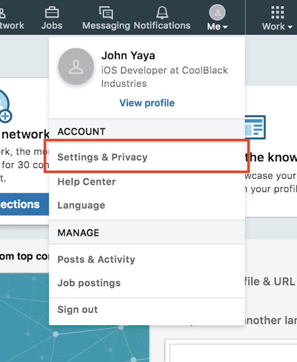
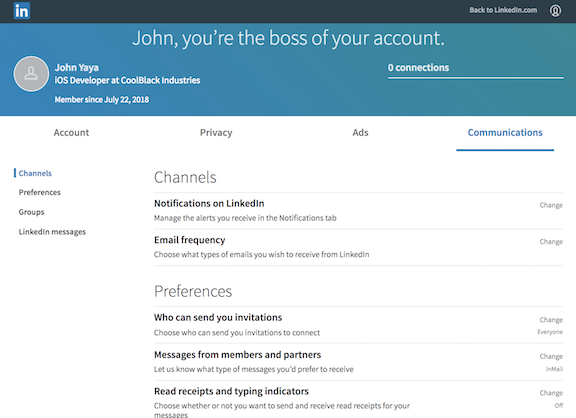

# Before You Get Started {#before-you-get-started}

## Uploading Your Contacts {#before-you-get-started-uploading-contacts}

LinkedIn will ask you to upload all of your address book. I do not recommend doing that.

LinkedIn takes the information in your contacts - names, phone numbers, email addresses - and uses those to fill in holes in their social graph. Over time it builds a more complete picture of an individual - even if they do not have a LinkedIn account. This is one way that social networks build "friend suggestions" and the like.
LinkedIn will also try to get you to invite people from your contacts to connect on LinkedIn or invite them to create an account. This is pretty spammy and probably won't benefit *you* much at all.

You can skip uploading your contacts. Chances are it will ask again. And again. And again. 
Resistance is not futile. Keep skipping it.

## Changing Your Email Settings {#before-you-get-started-email-settings}

Perhaps the most annoying thing about LinkedIn is the volume of email it sends. Most of the engineers I know dislike it for only this reason. Before you do anything else on LinkedIn, update your email and notification settings.

Go to "Settings and Privacy":

 then the "Communications" tab.
 
 

You will definitely want to look at *every* section of this page and modfy most settings.

## Disable Profile Change Notifications {#before-you-get-started-profile-change-notifications}

Have you ever gotten an email from LinkedIn about one of your former coworkers changing a job? 
LinkedIn will notify all of your connections when anything on your profile changes. It is important to *disable* profile change notifications before starting any edits on your profile. Otherwise all of your connections will get spammed with each change you make.
 
[LinkedIn maintains a support document that outlines how to disable these notifications.](https://www.linkedin.com/help/linkedin/answer/86236/sharing-profile-changes-with-your-network)
 
When you are done making changes you can enable the notifications again.

## Backing Up Your Profile {#profile-backups}
Before you start making changes to your profile it is a good idea to make a backup.
To back up your LinkedIn data request a data export from the [Member Data](https://www.linkedin.com/psettings/member-data) page. LinkedIn will email you a download link shortly after you request an export. Exporting profiles, connections and recommendations is generally quick. Larger exports can take much longer - a large export every few months is not a bad idea.

