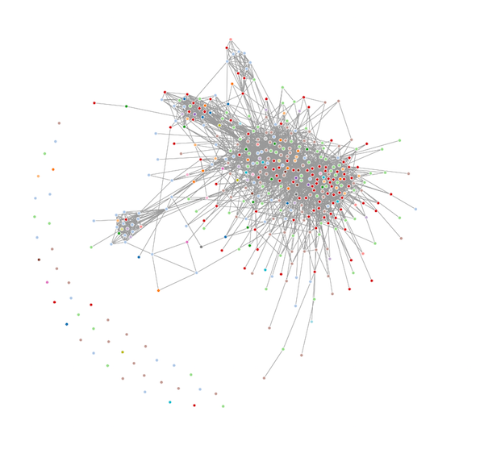

## Connections {#connections}

[TODO]: # (Common thinking about LinkedIn connections)

Metcalfe's Law states:

> The value of the network grows as the square of the size of the network

That is hard to argue with. As your personal network on LinkedIn grows the reach of your profile grows with it - exponentially. That said, some connections are more valuable than others. 

### Adding Connections

Look up people you have worked with in the past. Start by looking over the work experience you have listed on your profile. For each job, who in that company comes to mind first? Connect with them on LinkedIn.

You can also add people you know from places like Reddit, StackOverflow, or blogs you follow. When you connect with them write a short message introducing yourself.

### Visualizing Your Network

[Socilab](http://socilab.com/#home) is a tool for visualizing your LinkedIn connections graph. 

As your connections grow it can be a useful tool for seeing the big picture of how your network is changing.
