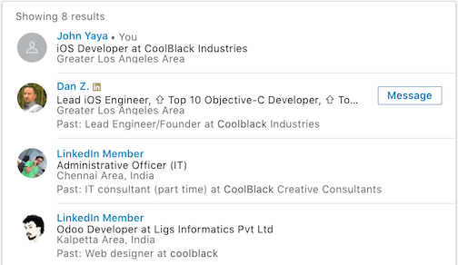

# Introduction

Simply having an account on LinkedIn is not enough. 

[TODO]: # (More in depth on why just having a profile is not enough)

In this book you will learn how to optimize your use of LinkedIn to be time efficient and effective. The goal is to get the opportunities you *want* to find *you*.

We will cover how to:

- Make your profile more visible by optimizing the content for search.
- Improve your profile to make it more attractive to employers.

Each of these will be broken down into actionable tasks that will not take much of your time. 

Let's get started by taking a look at LinkedIn search.

## A Look at LinkedIn Search

Finding you on LinkedIn starts with a search query and ends with your profile.  Let's look at the end of that process and work our way back to the beginning. 

### Your Profile {#linkedin-search-profile}

Your profile is the core of your presence on LinkedIn. It contains your work history, skills, education and more.  The LinkedIn search service indexes the content of your profile for searching. 

Most of this book will focus on your profile.

### Search Results {#linkedin-search-results}

When someone searches LinkedIn the results look like this:

Each result is constructed using the photo, name, headline, location, title and company information from a user's profile. This what anyone searching for you will see first - keep that in mind when editing your profile. 

Here "John Yaya" has just signed up for LinkedIn and provided the minimum information the onboarding process required. 

The "LinkedIn Member" results are for members not in John Yaya's network. Their names and profile information are masked - we'll come back to this in a minute.

"Dan Z." on the other hand is a user with a "premium" account. LinkedIn Premium is a paid subscription that allows you to appear more prominent in search results. This user isn't in John Yaya's network but still appears without information being masked or removed. 

### Search Query {#linkedin-search-query}

LinkedIn searches *only* profiles that the user doing the search is connected to by 1, 2 or 3 degrees. That means you can search your connections, the connections of your connections, and the connections of those connections. Any results outside of that network get masked or anonymized - the "LinkedIn Member" results we saw in the search results.

The search service finds profiles that contain text that matches the query. It doesn't have to be an exact match. The search service can "stem" some words, treating "developers" as equivalent to "developer". It can also treat some words as synonyms. In general though, don't depend on the search service being particularly smart. 

The matching profiles are then ordered by relevance. This is where things get interesting. A number of different factors influence relevance in LinkedIn search - some of them may surprise you. We'll cover this in depth later in the book.

Everyone looking for you on LinkedIn uses search. Small companies may use the same search features available to you. A large recruiting firm may use a LinkedIn Recruiter account - an expensive option that gives them additional searching and filtering options that go far beyond what we have covered so far. For example, they can filter on "number of years of experience" which is based on your work history.

> W Note that while LinkedIn Recruiter accounts cost thousands, LinkedIn Sales Navigator costs $50-100 a month and offers many of the same search filters. As you refine your profile it may be worthwhile to use a Sales Navigator account for a month to be able to see yourself as recruiter would. 

