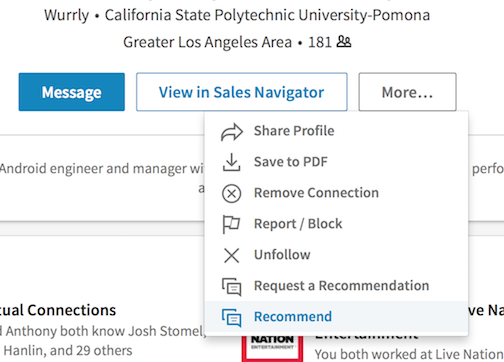

## Recommendations

Look up the person you want to recommend. You should be connected to them on LinkedIn *before* you recommend them. So if you aren't connected, connect to them first.

On their profile page click "More..." and select "Recommend"

Sometimes writing a recommendation just flows out of you into the keyboard. And sometimes the tiny, empty text field just seems to be sitting there mocking you. 

For those times you can use a recommendation generator as a starting point.

[Here is one](http://linkedin.bitshare.cm/recommendations.php)

[And here is another](http://socialrecommendator.com)
