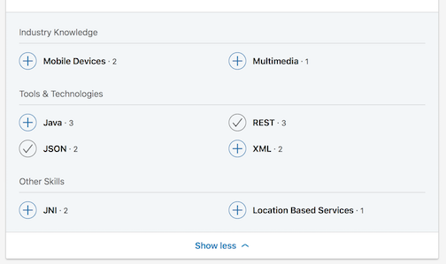

## Skills {#skills}

To add a skill to your profile go to “Add new profile section…” in the upper right of your profile page. 

Scroll down to “Skills”. Click the "+" icon. This will present a dialog for entering a skill. Think about something you did or used in your last job. It could be a language (i.e. Swift), a framework (i.e. Core Animation), a tool (i.e. Xcode), etc. Are you the go-to guy for Core Data or table view questions? Add those. Think about what your co workers know you for. Those are the kinds of things you definitely want to add.

### Endorsements {#endorsements}
LinkedIn skills are most valuable when another user endorses you for that skill. That "social proof" is a signal to both LinkedIn and potential hiring managers that you actually know your stuff. One of the best ways to get endorsements is to endorse other people. Look up some of the people you have worked with before and look at their skills. If you feel they really know one of the skills on their profile endorse them for it. There is a good chance they will do the same back for you.

#### Endorsing Someone You Know

Browse to their profile. You can use search, you connections list, or even Google to find it.
Scroll down to "Skills & Endorsements". 

Click the "+" icon to endorse a skill that is listed.

[LinkedIn Help: Endorsing Someone's Skills](https://www.linkedin.com/help/linkedin/answer/33196/endorsing-someone-s-skills)

Only endorse someone you know, and only for skills you know they have. Don't endorse someone for a skill you have never personally seen them demonstrate.

> T ## Endorse Skills on a Schedule
> T Endorsing the skills of your connections is something you can do regularly with very little effort. 
> T Set a weekly or monthly calendar reminder to do three endorsements. It will only take a couple of minutes and should raise your visibility on LinkedIn.