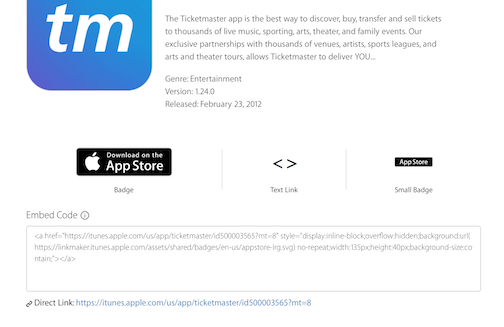

# iTunes Link Maker

Look up the app using 
[iTunes Link Maker](https://linkmaker.itunes.apple.com/en-us)

In the "Media Type" dropdown, select "iOS Apps" (or "macOS Apps" for the Mac App Store).

Search for the app by name or bundle ID. You should see a result like this:

This will give you the name, app store description, and a direct link to the download page. The direct link at the bottom of the page is what you will want for your LinkedIn profile.